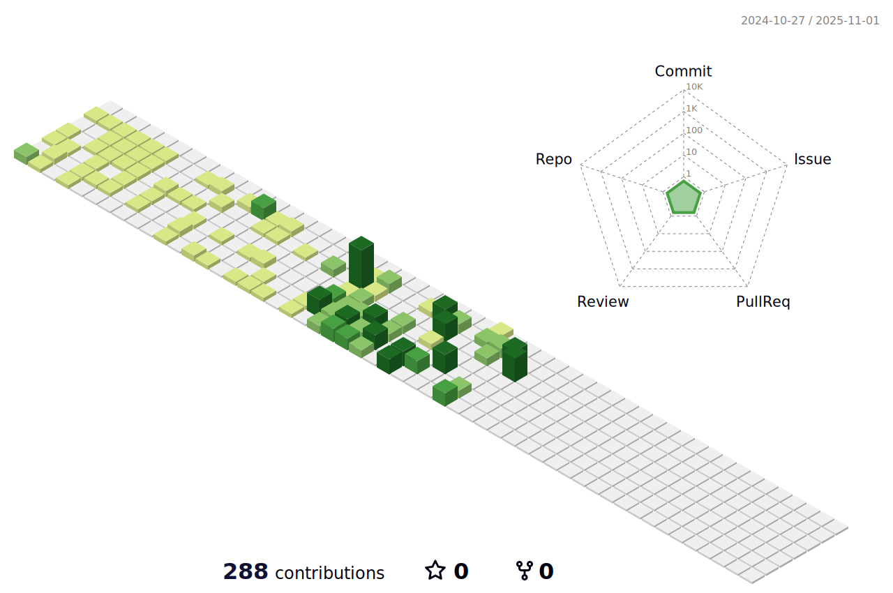

### Hi! Welcome to My Github Profile 👋

- 🔭 I’m a Full Stack Automation Engineer                                                                            
- 🌱 I'm working on a project with framework TestNG and Cucumber
- 💪 My goals: To bring out quality projects.
- ⚡ Fun fact: I love coding 💻, reading 📚, writing blog 🖋️, volleyball 🏐, seeing new places✈️ and listening music 🎶. 
- 👀 I am passionate about learning new technologies and enjoy solving problems 🔥.
- ⏲ What we are doing now: i am writing code 🚀.
- 📫 How to reach me **rsparmaksiz@gmail.com**

 </a>
 
 

 
## <b> Languages and Tools:</b>
</a> 
 
 
<a href="https://www.python.org/" target="_blank" rel="noreferrer"> 
 
 <a href="https://www.w3.org/html/" target="_blank" rel="noreferrer">
 
 
 
 
<a href="https://www.mysql.com/" target="_blank" rel="noreferrer">
<a href="https://www.selenium.dev/" target="_blank" rel="noreferrer">  
 
 </a>
 
 

 

 
 
 <!--   -->
  
  
  <!--  -->
  
  

<!-- 
name: GitHub-Profile-3D-Contrib

on:
  schedule: # 03:00 JST == 18:00 UTC
    - cron: "0 18 * * *"
  workflow_dispatch:

jobs:
  build:
    runs-on: ubuntu-latest
    name: generate-github-profile-3d-contrib
    steps:
      - uses: actions/checkout@v3
      - uses: yoshi389111/github-profile-3d-contrib@0.7.1
        env:
          GITHUB_TOKEN: ${{ secrets.GITHUB_TOKEN }}
          USERNAME: ${{ github.repository_owner }}
      - name: Commit & Push
        run: |
          git config user.name github-actions
          git config user.email github-actions@github.com
          git add -A .
          git commit -m "generated"
          git push
-->
  
<!---
Rsp/RSP is a ✨ special ✨ repository because its `README.md` (this file) appears on your GitHub profile.
You can click the Preview link to take a look at your changes.
--->

 
 

 
##  <b>My Stats</b>

 

